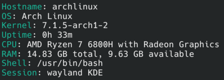

Yet Another Neofetch Clone is a fetch program inspired by neofetch but written in python instead of C, built for linux.
<br><br>


# Installation

> Install Dependencies for cloning repo (git, fakeroot, debugedit)
> Clone the repo ```git clone https://github.com/opsecball/yanc.git```
> Build the repo from source ```cd yanc && makepkg -si```
> Usage ```yanc```